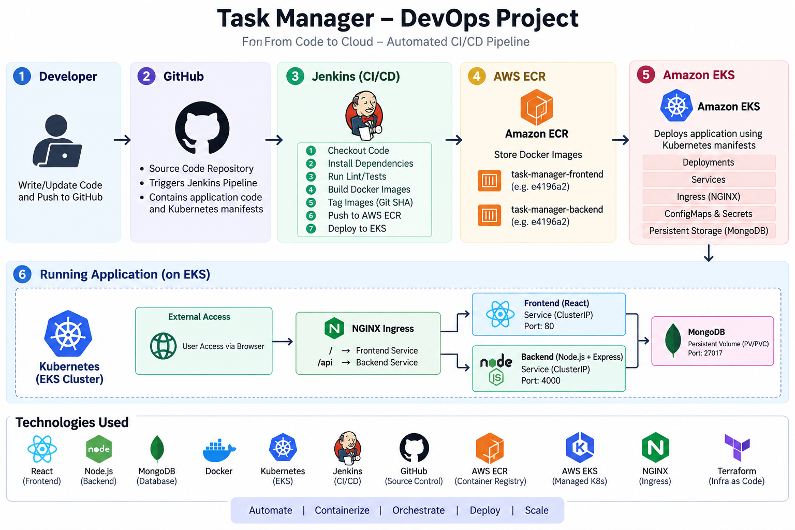
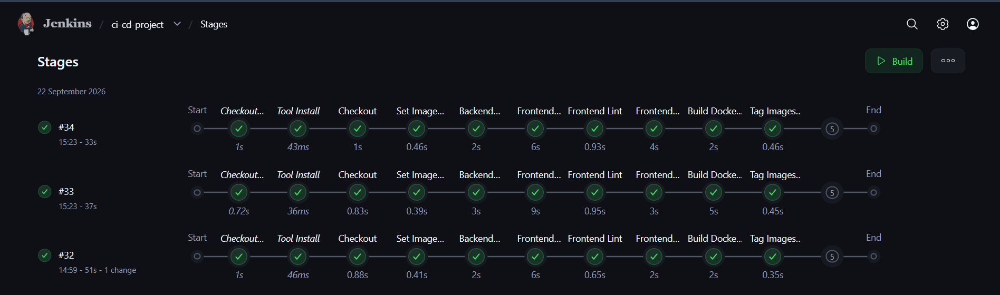
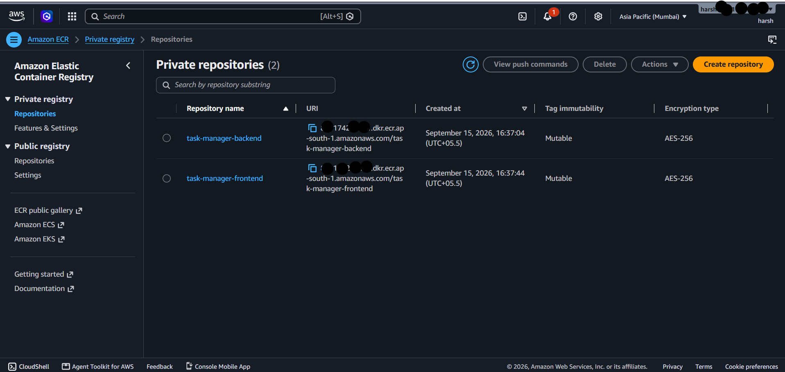
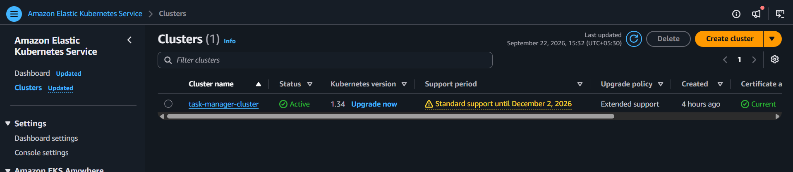
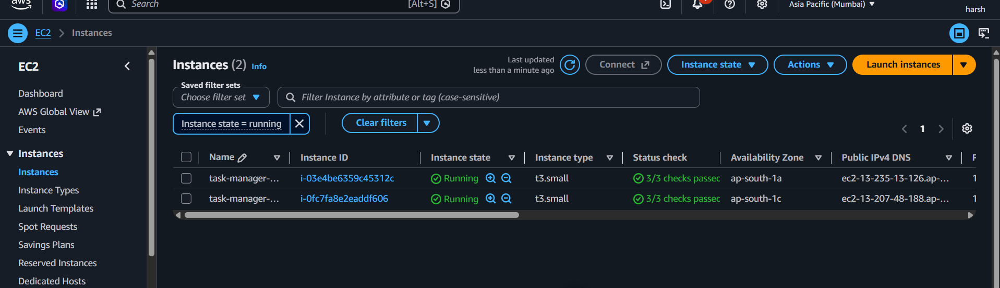
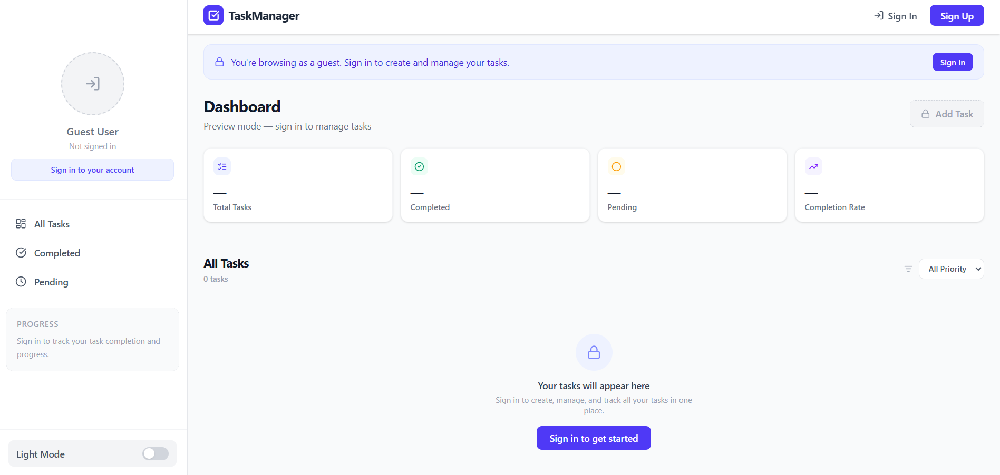

# 🚀 Task Manager — End-to-End DevOps CI/CD Project

A full-stack Task Manager application deployed through an automated **CI/CD pipeline** using Jenkins, Docker, Amazon ECR, Amazon EKS, and Kubernetes.

---

## 📌 Project Overview

This project demonstrates an end-to-end DevOps workflow starting from source code management and continuing through containerization, image publishing, Kubernetes deployment, and automated rollout verification.

### 🔄 CI/CD Workflow

<!-- Add your workflow image here -->
<!-- Recommended filename: docs/images/ci-cd-workflow.png -->

<p align="center">
  
</p>

**Workflow:**

```text
Developer → GitHub → Jenkins → Docker → Amazon ECR → Amazon EKS → Kubernetes → Application
```

---

## 🛠️ Technologies Used

| Category | Technology |
|---|---|
| Frontend | React, Vite |
| Backend | Node.js, Express |
| Database | MongoDB |
| Containerization | Docker, Docker Compose |
| CI/CD | Jenkins |
| Source Control | Git, GitHub |
| Container Registry | Amazon ECR |
| Orchestration | Kubernetes |
| Cloud Kubernetes | Amazon EKS |
| Cloud Platform | AWS |
| Ingress | NGINX Ingress Controller |
| Authentication | JWT |
| Image Versioning | Git Commit SHA |

---


The application consists of:

- React/Vite frontend
- Node.js/Express backend
- MongoDB database
- Docker containers
- Jenkins CI/CD pipeline
- Amazon ECR image repositories
- Amazon EKS Kubernetes cluster
- Kubernetes Services, Secrets, ConfigMaps and persistent storage
- NGINX Ingress Controller

---

# 📁 Project Structure

```text
ci-cd-project/
│
├── backend/
│   ├── Dockerfile
│   ├── package.json
│   └── ...
│
├── frontend/
│   ├── Dockerfile
│   ├── nginx.conf
│   ├── package.json
│   └── ...
│
├── k8s/
│   ├── namespace.yml
│   │
│   ├── backend/
│   │   ├── configmap.yml
│   │   ├── deployment.yml
│   │   ├── secret.yml
│   │   └── service.yml
│   │
│   ├── frontend/
│   │   ├── deployment.yml
│   │   └── service.yml
│   │
│   ├── mongodb/
│   │   ├── deployment.yml
│   │   ├── pv.yml
│   │   ├── pvc.yml
│   │   ├── secret.yml
│   │   └── service.yml
│   │
│   └── ingress/
│       └── ingress.yml
│
├── docker-compose.yml
├── Jenkinsfile
├── .gitignore
└── README.md
```

---

# 🔄 CI/CD Pipeline

The Jenkins pipeline automates the complete build and deployment process.

### Pipeline Stages

```text
Checkout
   ↓
Set Image Tag
   ↓
Install Dependencies
   ↓
Frontend Lint
   ↓
Frontend Build
   ↓
Build Docker Images
   ↓
Tag Images for ECR
   ↓
Login to ECR
   ↓
Push Images to ECR
   ↓
Deploy to EKS
   ↓
Verify EKS Deployment
```

## Jenkins Pipeline

<!-- Add Jenkins pipeline screenshot here -->
<!-- Recommended filename: docs/images/jenkins-pipeline.png -->

<p align="center">
  
</p>

The pipeline automatically:

- Checks out the latest code from GitHub
- Installs frontend and backend dependencies
- Runs frontend linting
- Builds the frontend
- Builds Docker images
- Tags images using the Git commit SHA
- Pushes images to Amazon ECR
- Updates Kubernetes deployments in Amazon EKS
- Verifies backend and frontend rollouts

---

# 🏷️ Git SHA Image Versioning

Instead of using the `latest` tag, the pipeline uses the Git commit SHA.

Example:

```text
Git Commit
    ↓
e4196a2
    ↓
Backend Image
task-manager-backend:e4196a2

Frontend Image
task-manager-frontend:e4196a2
```

The Jenkins pipeline generates the tag using:

```groovy
env.IMAGE_TAG = sh(
    script: 'git rev-parse --short HEAD',
    returnStdout: true
).trim()
```

This makes each Docker image traceable to a specific Git commit.

---

# 🐳 Docker

The application uses separate Docker images for the frontend and backend.

## Backend

The backend is containerized using Node.js.

```text
backend/
└── Dockerfile
```

## Frontend

The frontend is built using Node.js and served using NGINX.

```text
frontend/
├── Dockerfile
└── nginx.conf
```

The frontend uses a relative API URL so that Kubernetes Ingress can route:

```text
/      → frontend-service
/api   → backend-service
```

---

# 🧩 Docker Compose

Docker Compose is used for local development.

```text
┌────────────────────┐
│     Frontend       │
│      :3000         │
└─────────┬──────────┘
          │
          ▼
┌────────────────────┐
│      Backend       │
│      :4000         │
└─────────┬──────────┘
          │
          ▼
┌────────────────────┐
│      MongoDB       │
│      :27017        │
└────────────────────┘
```

Start the application:

```bash
docker compose up -d --build
```

Check containers:

```bash
docker compose ps
```

Stop the application:

```bash
docker compose down
```

---

# ☁️ AWS Infrastructure

The application is deployed to **Amazon EKS** and Docker images are stored in **Amazon ECR**.

## Amazon EKS

```text
Cluster Name: task-manager-cluster
Region: ap-south-1
Node Group: task-manager-nodes
Nodes: 2
Instance Type: t3.small
```

## Amazon ECR

Two repositories are used:

```text
task-manager-backend
task-manager-frontend
```

Example images:

```text
881174216441.dkr.ecr.ap-south-1.amazonaws.com/task-manager-backend:e4196a2

881174216441.dkr.ecr.ap-south-1.amazonaws.com/task-manager-frontend:e4196a2
```

---

## 📦 Amazon ECR Screenshot

<!-- Add ECR screenshot here -->
<!-- Recommended filename: docs/images/ecr-repositories.png -->

<p align="center">
  
</p>

---

## ☸️ Amazon EKS Screenshot

<!-- Add EKS screenshot here -->
<!-- Recommended filename: docs/images/eks-cluster.png -->

<p align="center">
  
  
</p>

---

# ☸️ Kubernetes Deployment

All application resources are deployed inside the:

```text
task-manager
```

namespace.

### Kubernetes Resources

- Namespace
- Deployments
- Services
- ConfigMaps
- Secrets
- PersistentVolume
- PersistentVolumeClaim
- Ingress

### Apply Namespace

```bash
kubectl apply -f k8s/namespace.yml
```

### Apply MongoDB

```bash
kubectl apply -f k8s/mongodb/
```

### Apply Backend

```bash
kubectl apply -f k8s/backend/
```

### Apply Frontend

```bash
kubectl apply -f k8s/frontend/
```

### Apply Ingress

```bash
kubectl apply -f k8s/ingress/
```

Check all resources:

```bash
kubectl get all -n task-manager
```

Check pods:

```bash
kubectl get pods -n task-manager
```

---

# 🔀 Kubernetes Services

The application uses Kubernetes internal services.

```text
frontend-service
      │
      │ port 80
      ▼
Frontend Pods


backend-service
      │
      │ port 4000
      ▼
Backend Pods


mongodb-service
      │
      │ port 27017
      ▼
MongoDB Pod
```

The frontend, backend, and MongoDB communicate through Kubernetes Services.

---

# 🌐 NGINX Ingress

NGINX Ingress is configured to route application traffic:

```text
                    Ingress
                       │
             ┌─────────┴─────────┐
             │                   │
            /                    /api
             │                   │
             ▼                   ▼
     frontend-service      backend-service
             │                   │
             ▼                   ▼
        Frontend Pods       Backend Pods
```

The intended routing is:

```text
/      → frontend-service:80
/api   → backend-service:4000
```

> **Note:** The AWS account currently has a restriction preventing creation of the external AWS Load Balancer for the NGINX Ingress Controller. Therefore, public external Ingress access is not currently enabled. The Kubernetes Ingress configuration is retained for the intended architecture.

---

# 💾 MongoDB Persistence

MongoDB uses Kubernetes persistent storage:

```text
MongoDB Pod
    │
    ▼
PersistentVolumeClaim
    │
    ▼
PersistentVolume
```

Configuration:

```text
Capacity: 500Mi
Access Mode: ReadWriteOnce
Reclaim Policy: Retain
Storage Class: manual
```

---

# 🔐 AWS IAM & Jenkins

A dedicated IAM user is used by Jenkins:

```text
JenkinsECRUser
```

The Jenkins AWS identity is configured with permissions required for:

- Amazon ECR image push operations
- EKS cluster description
- Kubernetes access through the EKS access entry

EKS access is scoped to the:

```text
task-manager
```

namespace.

AWS credentials are stored in **Jenkins Credentials** and are not hardcoded in the Jenkinsfile.

---

# 🔐 Security Practices

- AWS credentials are stored in Jenkins Credentials.
- Backend `.env` files are excluded from Git.
- Kubernetes Secrets are used for sensitive configuration.
- A dedicated IAM identity is used by Jenkins.
- EKS access is scoped to the application namespace.
- Docker images use Git SHA tags instead of relying on `latest`.
- Secrets and access keys are not committed to GitHub.

> **Never commit AWS access keys, database passwords, JWT secrets, or other sensitive credentials to GitHub.**

---

# 🧪 Testing

## Backend Test

Forward the backend service:

```bash
kubectl port-forward -n task-manager svc/backend-service 4001:4000
```

Test the API:

```bash
curl http://localhost:4001/api/tasks
```

An unauthenticated request returns:

```json
{
  "success": false,
  "message": "Authorization failed, token missing !"
}
```

This confirms that the backend is reachable and authentication middleware is active.

---

## Frontend Test

Forward the frontend service:

```bash
kubectl port-forward -n task-manager svc/frontend-service 8081:80
```

Open:

```text
http://localhost:8081
```

---

# 🖥️ Application Screenshot

<!-- Add your Task Manager application screenshot here -->
<!-- Recommended filename: docs/images/task-manager-app.png -->

<p align="center">
  
</p>

---

# 📊 Kubernetes Deployment Verification

The Jenkins pipeline verifies the deployment using:

```bash
kubectl rollout status deployment/backend \
    -n task-manager \
    --timeout=180s

kubectl rollout status deployment/frontend \
    -n task-manager \
    --timeout=180s
```

A successful pipeline confirms that the new Docker image has been deployed and the Kubernetes rollout completed successfully.

---

# 🎯 Project Outcome

The final implementation demonstrates an automated DevOps workflow:

```text
Code Change
     ↓
   GitHub
     ↓
   Jenkins
     ↓
Docker Build
     ↓
Amazon ECR
     ↓
Amazon EKS
     ↓
 Kubernetes
     ↓
Application
     ↓
Rollout Verification
```

The project provides hands-on experience with:

- Git & GitHub
- Docker
- Docker Compose
- Jenkins
- CI/CD
- Amazon ECR
- AWS IAM
- Amazon EKS
- Kubernetes
- NGINX
- Deployments
- Services
- ConfigMaps
- Secrets
- PersistentVolumes
- PersistentVolumeClaims
- Ingress
- Git SHA image versioning
- Automated Kubernetes deployments

---

# 📚 Key DevOps Concepts Demonstrated

### Containerization
Docker and Docker Compose are used to package and run the application consistently.

### Continuous Integration
Jenkins automatically checks out the code, installs dependencies, lints/builds the frontend, and builds Docker images.

### Continuous Deployment
After successful ECR pushes, Jenkins updates the application deployments running in Amazon EKS.

### Immutable Image Versioning
Git commit SHA tags provide a traceable relationship between source code and deployed container images.

### Kubernetes Orchestration
EKS manages the frontend, backend, and MongoDB workloads using Kubernetes resources.

### Cloud IAM
Jenkins uses a dedicated AWS IAM identity instead of personal AWS credentials.

---

# 👨‍💻 Author

**Harsh Jani**

GitHub: [harshjani02](https://github.com/harshjani02)

---

## ⭐ Project Highlights

```text
✅ Dockerized Full-Stack Application
✅ Docker Compose Local Environment
✅ Jenkins CI/CD Pipeline
✅ Git SHA Image Versioning
✅ Amazon ECR
✅ Amazon EKS
✅ Kubernetes Deployment
✅ Automated EKS Deployment
✅ Kubernetes Rollout Verification
✅ AWS IAM Integration
✅ NGINX Ingress Configuration
✅ MongoDB Persistent Storage
```
